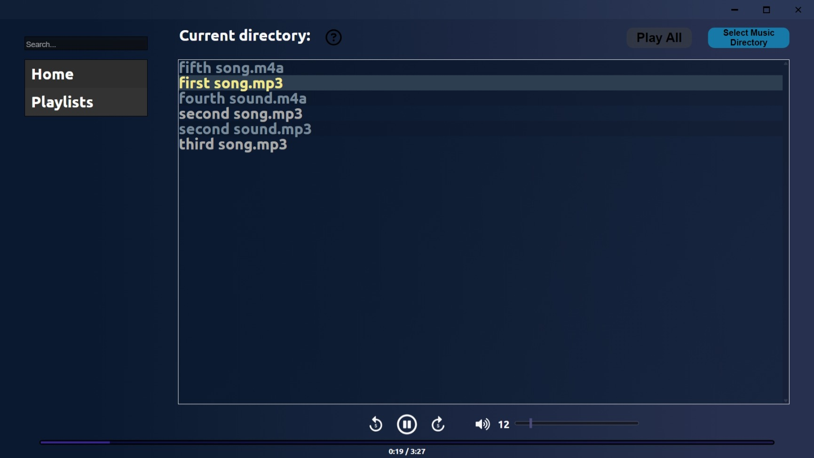
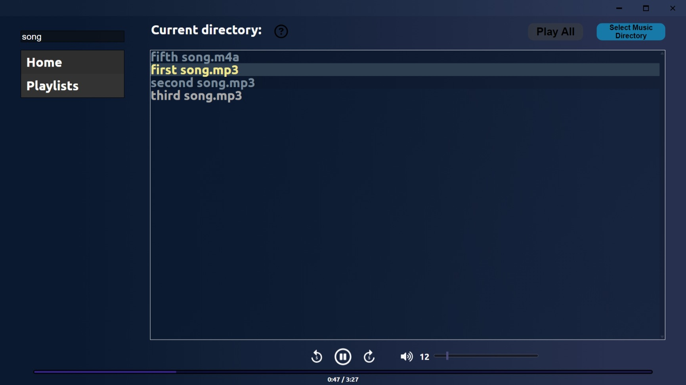

# Frog Player🐸🎵

Frog Player is a lightweight, local music player desktop app for Windows built with ReactJS and Tauri. Users can select a local directory from their computer and play music through a simple interface.

## Features

- [x] Play local music from a selected directory
- [x] Play, pause, navigate, and adjust volume with player controls.
- [x] Search for specific music
- [ ] Create custom playlists

## Screenshots

